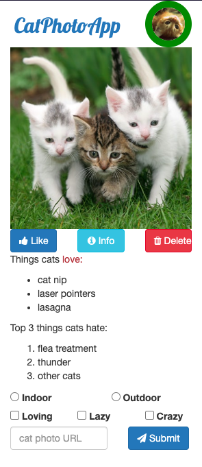
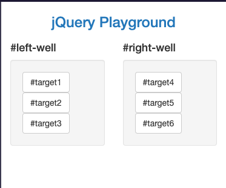
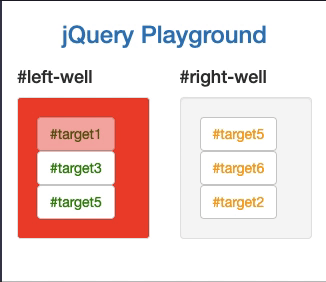
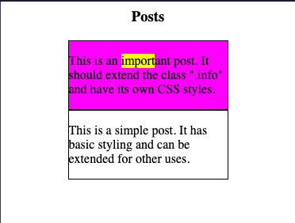

# FCC-3_frontend-dev
This repository contains my answers for freecodecamp, Front End Development Libraries certification.
### Topics:
#### Bootstrap, jQuery, SASS, React, Redux, React and Redux, Front End Development Libraries Projects

*** 

(image source: https://www.freecodecamp.org/learn/front-end-development-libraries/)

### Completed tasks:

#### Bootstrap 1.1: [catphotoapp-bootstrap.html](catphotoapp-bootstrap.html)

#### Bootstrap 1.2: [jQueryPlayground-bootstrap](jQueryPlayground-bootstrap.html)

#### [jQuery](jQuery.html)

#### [SCSS-final-topic](extend-one-set-of-css-styles-to-another-element
.html)

extend-one-set-of-css-styles-to-another-element

