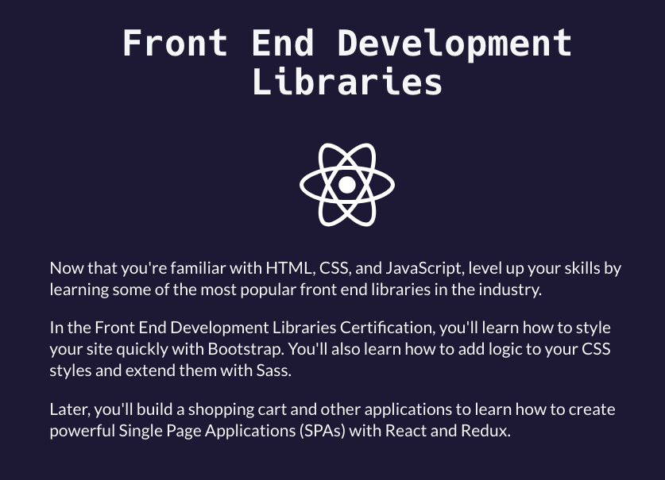

# FCC-3_frontend-dev
This repository contains my answers for freecodecamp, Front End Development Libraries certification.
### Topics:
#### Bootstrap, jQuery, SASS, React, Redux, React and Redux, Front End Development Libraries Projects

*** 

(image source: https://www.freecodecamp.org/learn/front-end-development-libraries/)

#### Bootstrap 1.1: line-up-form-elements-responsively-with-bootstrap.png

